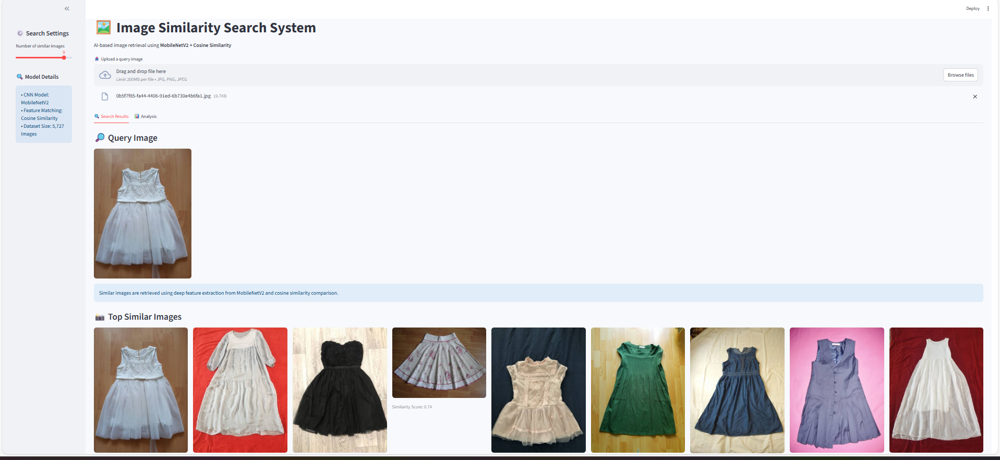

# AI-Powered Image Similarity Search and Recommendation System
Project Overview

This project implements an AI-powered image similarity search and recommendation system for fashion products. The system retrieves visually similar images from a dataset based on a query image. It uses deep learning–based feature extraction and cosine similarity to compare images and provide accurate recommendations.
The solution is suitable for e-commerce platforms, fashion recommendation systems, and visual product search applications.

## Features
- Deep learning–based image feature extraction
- Image similarity search using cosine similarity
- Fast retrieval of visually similar images
- Scalable architecture for large image datasets
- Suitable for online fashion product recommendation

## Methodology
1) Image dataset collection and preprocessing.
2) Feature extraction using MobileNet (pre-trained CNN model).
3) Generation of feature embeddings for all dataset images.
4) Similarity comparison using cosine similarity.
5) Retrieval and ranking of top similar images.
6) Display recommended images to the user.

## 📁 Project Structure
```
project/
│
├── dataset/
├── models/
├── feature_extraction.py
├── similarity_search.py
├── app.py
├── requirements.txt
└── README.md
```

## Dataset
The project uses a publicly available Kaggle fashion dataset containing over 5,000 images of clothing items including:
- Tops
- Jackets
- Dresses
- Shirts
- Footwear

## Technologies Used
- Python
- TensorFlow / Keras
- MobileNet CNN
- NumPy
- OpenCV / PIL
- Scikit-learn
- FAISS / Cosine Similarity
- Matplotlib
- Streamlit (Dashboard)

## Results & Observations
- Experimental evaluation shows that:
- Images with similar shapes and textures obtain higher similarity scores.
- Visually dissimilar items are ranked lower.
- Feature embeddings effectively capture visual characteristics for retrieval tasks.

## Dahboard - Image Similarity Search System
This dashboard interface demonstrates the Image Similarity Search System, where a user uploads a query image and visually similar products are automatically retrieved from the dataset. After upload, the image is preprocessed and passed through a pretrained MobileNet model to extract deep visual features. These features are then compared with stored dataset embeddings using cosine similarity to measure visual closeness. The system ranks images based on similarity scores and displays the most relevant matching results, enabling efficient visual search and product recommendation.


